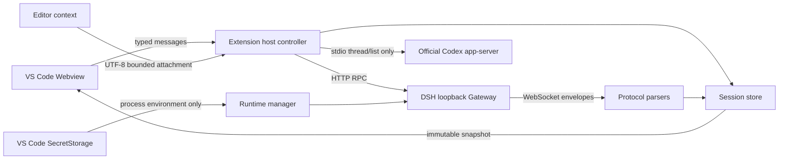

# 架构

## 核心决策

本扩展选择原生 VS Code UI 加 DeepSeek Harness HTTP/WebSocket Gateway，而不是嵌入 Harness Web 页面或把 ACP 当成完整后端。Gateway 能提供会话历史、流式事件、工具状态、审批、问题、取消和模型控制；当前 ACP 接口不足以还原这些工作台能力。

终端用户路径采用平台专用 VSIX。`@deepseek-ai/dsh@0.1.1-rc.1`、Node.js `22.22.3` 和 pnpm `11.21.0` 在发布时固定并打包，激活阶段禁止包管理器、克隆和全局安装。external runtime 只是明确配置后的兼容入口，不承担自动发现或修复。

## 模块边界

| 模块 | 职责 | 不负责 |
| --- | --- | --- |
| `src/config` | 读取、校验和更新 VS Code 设置 | 凭据持久化 |
| `src/security` | 通过 `SecretStorage` 管理 API Key | 把密钥写入文件或日志 |
| `src/platform` | 存储布局和结构化日志 | 运行时协议 |
| `src/runtime` | 解析、校验、启动、诊断和停止运行时 | 渲染聊天 UI |
| `src/gateway` | HTTP RPC、WebSocket 事件与协议边界校验 | 会话展示状态 |
| `src/session` | 会话状态机和事件投影 | 直接操作 Webview DOM |
| `src/context` | 选区、文件和诊断附件的字节限制 | 任意二进制上传 |
| `src/handoff` | 只读发现外部会话、规范化交接包和原生 CLI 启动 | 修改 Codex/Claude 原始会话或共享凭据 |
| `src/diff` | Git porcelain 解析和只读 diff 基线 | 自动提交或回滚 |
| `src/ui` | Webview 协议、渲染和用户交互 | 直接生成 shell 命令 |

## 数据流



Webview 只发送定义在 `webview-protocol.ts` 的消息。Extension host 对 Gateway 的 JSON 边界执行结构检查，再把事件投影成不可变快照。一个 `question/requested` 的所有题目按 `rpcId` 保持为同一批次，Webview 只允许一次提交完整 `answers[]`。模型、reasoning effort 和 Agent Preset 目录来自 Host，并以 Host 的选择响应作为权威值。未知或畸形帧应进入诊断路径，不能直接进入 UI。

上下文占用不按字符数猜测。Controller 只接受 `contextPressure` session projection 中的非负整数 `pressureTokens/projectedTokens` 和正整数 `contextWindow`；Webview 用 `projectedTokens` 优先显示下一次请求的近似占用。固定的 Standard、Code 和 Cordis preset 中，`compaction-basic` 在容量的 80% 触发自动压缩；Minimal 不安装压缩插件，自定义 preset 的策略未知。齿轮设置容量并更新可确认的阈值说明；收缩按钮只在支持压缩且 agent 空闲时发送 `/compact`。没有 provider usage 时不渲染占用环。

## 运行时生命周期

1. 激活时创建 `globalStorage` 布局并注册命令，不下载依赖。
2. 用户首次打开工作台或显式启动时，读取设置和 `SecretStorage`。
3. Windows extension host 先运行 UTF-8、空格/非 ASCII 路径、PowerShell 语言模式和 junction 探针；探针失败记录精确警告，不通过拼接 shell 命令自修复。
4. resolver 校验 VSIX 中的 DSH、Node 和 pnpm 文件及固定版本。
5. 扩展在 `generated/<version>/` 原子写入 overlay，并使用版本化 `DSH_HOME`。
6. 子进程以工作区为 `cwd`、`shell: false`、`127.0.0.1` 和端口 `0` 启动。
7. stdout 发布 loopback URL 后，controller 连接 HTTP/WebSocket Gateway 并恢复会话。
8. 停止、重启、停用或启动失败时，扩展清理整个进程树。

`startTask` 和 `stopTask` 合并并发请求，避免重复启动或交错停止。运行时进程只由创建它的扩展实例管理，不扫描或终止用户手动启动的 DSH。

## 存储所有权

```text
globalStorage/
  harness-homes/<version>/
  runtime-bin/
  generated/<version>/
  logs/
  tmp/
  snapshots/
  handoffs/<handoff-id>/
```

- `harness-homes` 是持久状态，并与 DSH 版本绑定。
- `generated`、`runtime-bin` 可由扩展重建。
- `tmp` 仅存一次性兼容性探针。
- `snapshots` 存 Git diff 的 HEAD 内容，不是备份系统。
- `handoffs` 存用户主动生成的规范化 JSON/Markdown；不复用 `.codex`、`.claude` 或 `DSH_HOME`。
- 仓库根目录 `.tmp/` 仅存开发期参考克隆，与扩展运行时完全分离。

## 安全边界

- 未受信任工作区禁止启动 Harness。
- API Key 只从 `SecretStorage` 读取，并只注入本地子进程环境。
- Gateway 固定绑定 loopback 随机端口，不接受外部监听地址设置。
- 默认权限为 `workspace-write`，更宽权限必须由用户显式选择。
- external command 和 external Node 必须是绝对路径，且版本探针必须通过。
- 进程启动参数使用数组传递；用户值不经过 PowerShell/cmd 字符串插值。
- Codex 历史发现只调用官方 app-server 的 `initialize` 与 `thread/list`；失败时关闭子进程并进入只读 JSONL 回退，不调用会话写入方法。
- 诊断输出必须继续遵守不打印密钥、Authorization header 或完整环境的约束。

## 上游版本策略

DeepSeek Harness 当前没有稳定兼容性保证，因此协议、运行时版本和 `DSH_HOME` 被视为一个升级单元。升级步骤：

1. 固定新的 DSH、Node、pnpm 版本并更新锁文件。
2. 比对 Gateway HTTP/WebSocket 帧和 session event 投影。
3. 增加协议回归测试，不用宽松类型掩盖新字段语义。
4. 为新版本创建独立 `harness-homes/<version>`，不迁移旧状态，除非上游提供迁移契约。
5. 在六个目标 OS/架构的原生 runner 上打包并检查 VSIX 内容。
6. 完成无密钥启动、正常停止和进程树清理的冒烟测试后再发布。

固定版本发生变化时，应同时更新 [compatibility.md](compatibility.md)、[references.md](references.md)、`CHANGELOG.md` 和 `THIRD_PARTY_NOTICES.md`。

`scripts/audit-vsix.mjs` 是发布边界的一部分：它检查平台 native binary、固定运行时、许可证和开发文件排除规则。`esbuild.mjs` 只替换两个 bundle，不清空 `dist/runtime`；运行时由 `prepare-runtime.mjs` 独立 staging、复制和切换，避免 Windows 文件锁让普通前端构建破坏已准备好的运行时。
